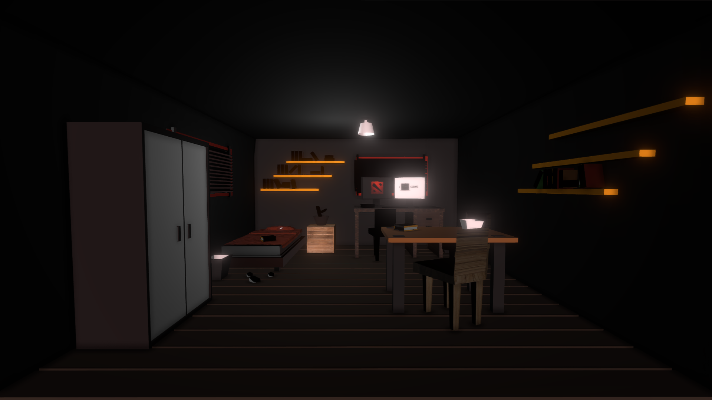

# Urban Room Environment  

This repository contains a **simple urban room environment** created in Blender as part of my internship assignment. The project focuses on basic 3D modeling, texturing, and lighting to create a realistic interior scene.  

## Features  
- **3D Modeling**: Detailed objects and furniture representing a typical urban room.  
- **Texturing**: Realistic materials and textures for added depth and authenticity.  
- **Lighting**: Proper illumination to highlight the room's ambiance.  

## Preview  
 

## Usage  
1. Clone the repository:  
   ```bash
   git clone https://github.com/XxAlonexX/Urban-Room-Blender
